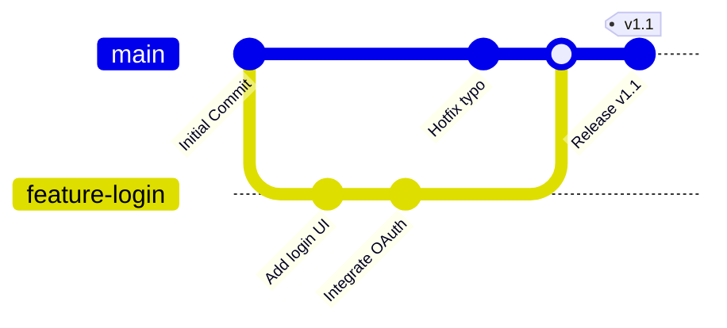

# Kenya Housing Survey 2024 County-Level Housing Affordability & Quality Analysis

[](https://www.python.org/)
[](https://pandas.pydata.org/)
[](LICENSE)

**A full cleaning pipeline and county-level analysis built from the KNBS Kenya
Housing Survey 2024 - 118 report tables across 9 chapters, turned into tidy data
and a flagship affordability/quality index.**

*_Nelson Wasike_*
 
 'https://www.linkedin.com/in/nelsonmaclain/?lipi=urn%3Ali%3Apage%3Ad_flagship3_feed%3BHKFrxL4eQBaB9JWyFdh7gw%3D%3D'
 
 'https://github.com/Nelson-Wasike'

## The question

Do Kenya's counties show a trade-off between owning a home and living in a
well-serviced one? This project builds a reusable pipeline that converts KNBS's
human-formatted report tables (merged cells, multi-row headers, embedded
national/rural/urban summary rows) into clean, analysis-ready data, then answers
that question at the county level.

## Headline finding

**Homeownership and housing quality move in opposite directions across counties**
(r = -0.84): counties with the highest ownership rates tend to have the lowest
housing-quality-index scores, while urban household share correlates strongly
*positively* with quality (r = 0.80). In plain terms - rural counties own more but
are serviced less; urban counties rent more but have better water, sanitation, and
overall dwelling quality. That has a direct policy implication: rural counties need
infrastructure investment more than ownership incentives, while urban counties need
affordability interventions more than infrastructure ones.

## What's in this repo

```
khs-housing-analysis/
├── data/
│   ├── raw/                          # original KNBS chapter workbooks
│   └── processed/
│       ├── tables/                   # 72 county-level tables, tidy CSVs
│       ├── tables_national/          # 46 national/reference tables, tidy CSVs
│       ├── master_county_indicators.csv   # 47 counties × 11 headline indicators + composite index
│       ├── chapter7_ESTIMATED_housing_finance.csv  # ESTIMATED - see caveats below
│       ├── CHAPTER7_ESTIMATED_README.md
│       └── qc_log.json               # parser QC output for all 118 tables
├── src/
│   ├── counties.py                   # 47-county reference list + name normalization
│   └── parser.py                     # the parsing engine (see "How the pipeline works")
├── notebooks/
│   └── 01_khs_housing_analysis.ipynb # full walkthrough with executed outputs and charts
├── reports/
│   └── KHS_2024_Policy_Brief.docx    # non-technical policy brief for circulation
├── images/                           # 6 charts
├── requirements.txt
└── README.md
```

## How the pipeline works

KNBS publishes these tables for human reading, not analysis - county names and
category labels only appear once per merged-cell block, national/rural/urban
summary rows are interleaved with the real county data, and structure varies table
to table. `src/parser.py` handles this in two passes:

1. **`parse_county_table`** - the dominant shape (a county broken down by an
   indicator, sometimes further split by a category like dwelling type). Forward-
   fills merged-cell columns, strips footnotes without mistaking mid-table blank
   rows for the end of the table, normalizes inconsistent county spelling (e.g.
   "Elgeyo- Marakwet" vs "Elgeyo-Marakwet"), and even detects a "two counties per
   row" page-space-saving layout used in a few tables.
2. **`parse_simple_table`** - the ~46 tables with no county breakdown at all
   (national totals, preference tables, classification legends).

Every one of the 118 tables across all 9 available chapters was run through this
pipeline - see `data/processed/qc_log.json` for the match-rate diagnostics on each.

## The master indicator table

`master_county_indicators.csv` joins one headline metric per chapter into a single
47-row table: urban household share, homeownership rate, average urban rent,
rent-to-expenditure ratio, home-purchase rate, housing quality index, improved
water/sanitation access, awareness of the Affordable Housing Program, building
permit approval time, and the Chapter 7 finance estimate - plus a derived
**Housing Affordability & Quality Index** (0–100), weighted 35% quality / 20% water
/ 20% sanitation / 25% affordability.

## Chapter 7 (Housing Finance) - estimated, not official

The Chapter 7 report wasn't part of the source data. `chapter7_ESTIMATED_housing_finance.csv`
is a modeled estimate built from related financing and awareness questions elsewhere
in the survey - **read `data/processed/CHAPTER7_ESTIMATED_README.md` before using it for
anything**, and never present it as actual KNBS Chapter 7 statistics.

## Policy Brief

`reports/KHS_2024_Policy_Brief.docx` is a 13-page, non-technical Word document
written for circulation - executive summary, county-level findings, and concrete
recommendations, with every chart embedded and the Chapter 7 estimate clearly
flagged throughout.

## Charts

1. The ownership-vs-quality paradox (flagship scatter)
2. Top/bottom 10 counties by housing quality index
3. Highest/lowest rent burden by county
4. Water vs sanitation access, colored by quality index
5. Full 47-county Housing Affordability & Quality Index ranking
6. Chapter 7 estimate ranking (clearly labeled)

**Data source:** [Kenya National Bureau of Statistics - Kenya Housing Survey 2024](https://www.knbs.or.ke/)



