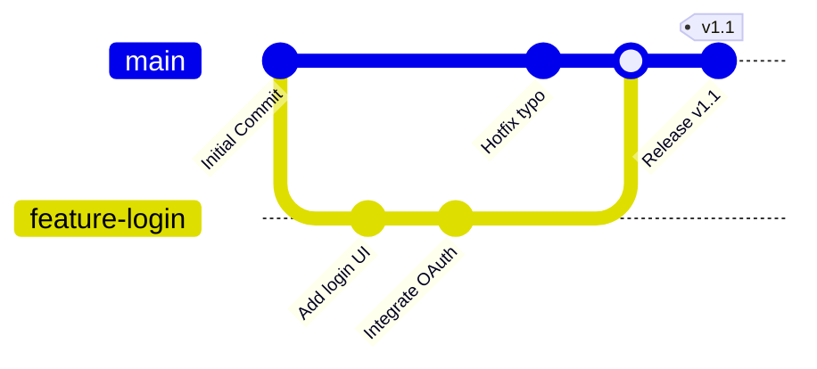

```mermaid
gitGraph
    commit id: "Initial Commit"
    branch feature-login
    checkout feature-login
    commit id: "Add login UI"
    commit id: "Integrate OAuth"
    checkout main
    commit id: "Hotfix typo"
    merge feature-login
    commit id: "Release v1.1" tag: "v1.1"
```
